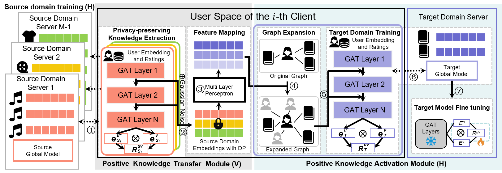
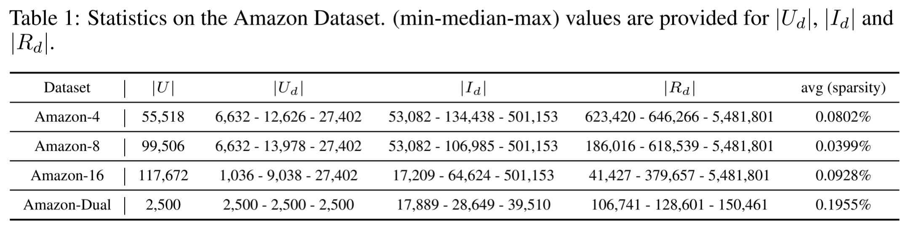
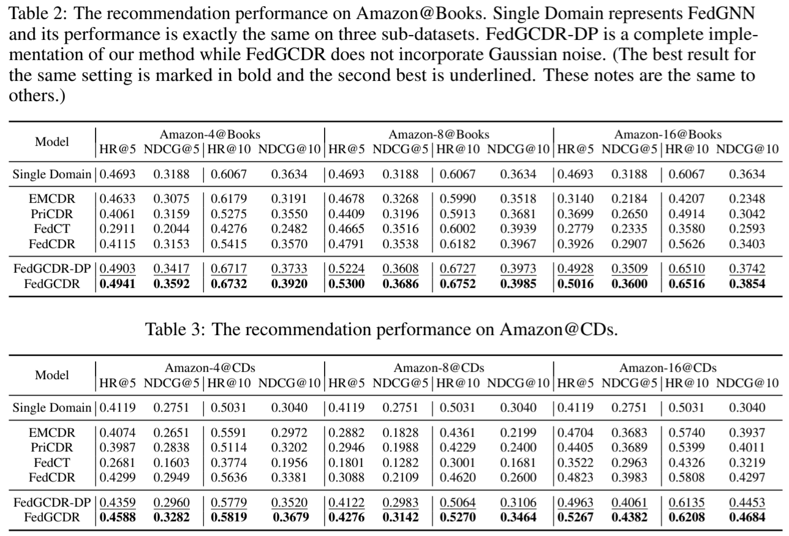

<!-- # Federated Graph Learning for Cross-Domain Recommendation (NeurIPS-2024)
<p align="center">
  
</p>

This is the implementation of FedGCDR in the following paper: \
Ziqi Yang, Zhaopeng Peng, Zihui Wang, Jianzhong Qi, Chaochao Chen, Weike Pan, Chenglu Wen, Cheng Wang, Xiaoliang Fan∗. "[Federated Graph Learning for Cross-Domain Recommendation]()", the Thirty-Eighth Annual Conference on Neural Information Processing Systems.

## Data&Code
Will be released soon. -->


<div align="center">

<h2 class="papername"> Federated Graph Learning for Cross-Domain Recommendation </h2>
<div>
<div>
    Ziqi Yang<sup>1,2</sup>, Zhaopeng Peng<sup>1,2</sup>, Zihui Wang<sup>1,2</sup>, Jianzhong Qi<sup>3</sup>, Chaochao Chen<sup>4</sup>,Weike Pan<sup>5</sup>, Chenglu Wen<sup>1,2</sup>, Cheng Wang<sup>1,2</sup>, Xiaoliang Fan<sup>1,2∗</sup>

</div>

<div><sup>1</sup>Fujian Key Laboratory of Sensing and Computing for Smart Cities, Xiamen University, China</div>
<div><sup>2</sup>Key Laboratory of Multimedia Trusted Perception and Efficient Computing,Ministry of Education of China, Xiamen University, China</div>
<div><sup>3</sup>School of Computing and Information Systems, The University of Melbourne, Australia</div>
<div><sup>4</sup>College of Computer Science and Technology, Zhejiang University Hangzhou, China</div>
<div><sup>5</sup>College of Computer Science and Software Engineering, Shenzhen University Shenzhen, China</div>
<div>*Corresponding author</div>
<br>
<div>

[The Thirty-eighth Annual Conference on Neural Information Processing Systems (NeurIPS 2024)](https://neurips.cc/Conferences/2024)

[[Paper]](https://arxiv.org/abs/2407.12709)

[](https://hits.seeyoufarm.com)

</div>
</div>
<br>

</div>


## Introduction

This is the github repository of *Federated Graph Learning for Cross-Domain Recommendation*. In this apper, we propose a federated graph learning framework to preserve intra and inter domain privacy while mitigating negative transfer in cross-domain recommendation.

Our method is consist of two key modules, the positive knowledge transfer module and the positive knowledge activation module. The first module can extract domain konwledge form graph attention networks in a privacy perserving mode and has a theoretical guarantee. The second module performs graph expansion with virtual social links and incorporates a fine-tuning process to filter potientially harmful information and make maximum use of external knowledge.

The architecture of the proposed model:

<div align="center">

</div>

## Benchmark

We conduct experiments on 16 popular domains of the Amazon datasets:

<div align="center">

</div>

## Evaluation results

Here we list the recommendation performance comparison of our method and baselines. Please refer to our paper for more details.

<div align="center">

</div>


## Citation

If you find this work useful for your research, please kindly cite our paper:
```
@inproceedings{shen2024mome,
    title={MoME: Mixture of Multimodal Experts for Generalist Multimodal Large Language Models}, 
    author={Shen, Leyang and Chen, Gongwei and Shao, Rui and Guan, Weili and Nie, Liqiang},
    booktitle={Advances in neural information processing systems},
    year={2024}
}
```
